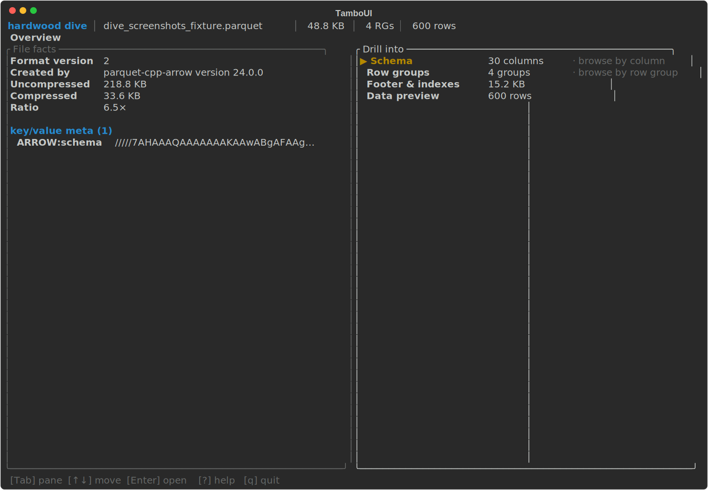
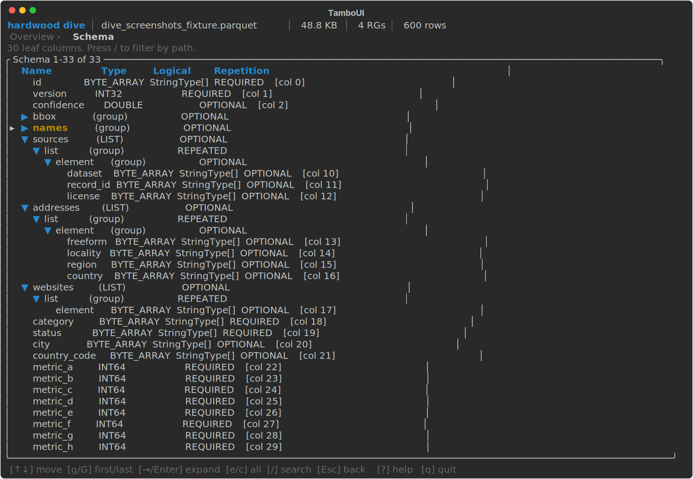
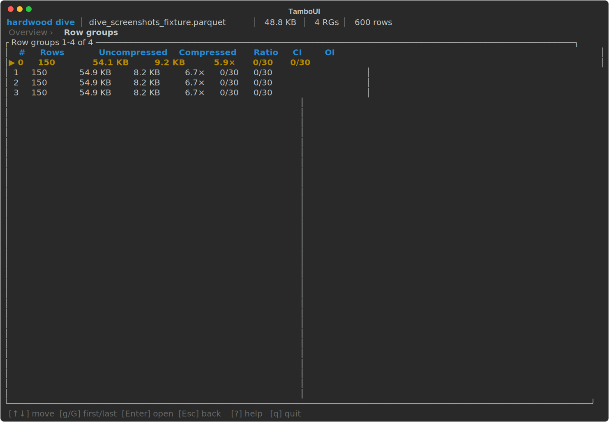
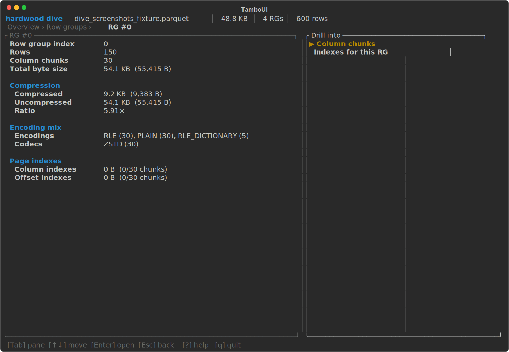
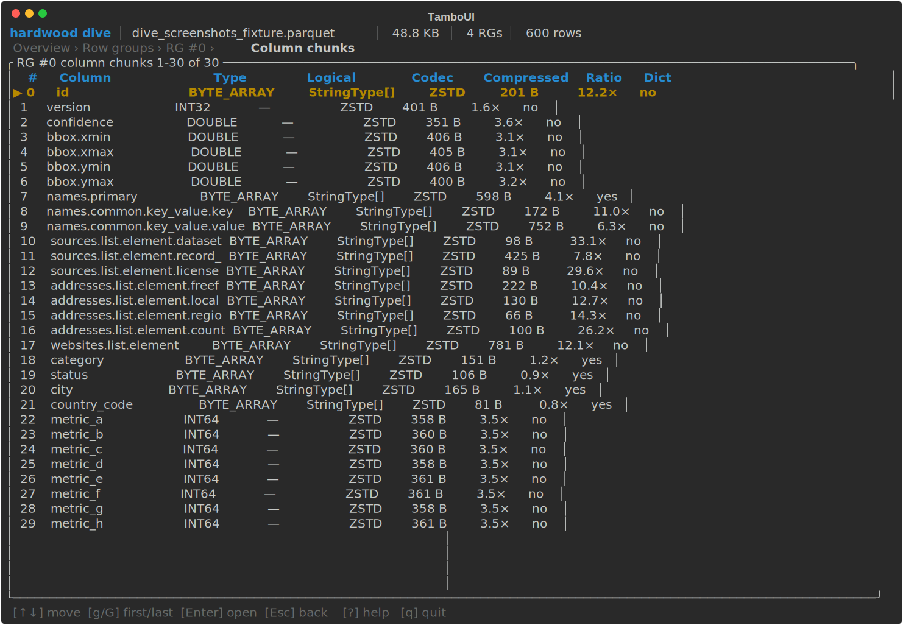
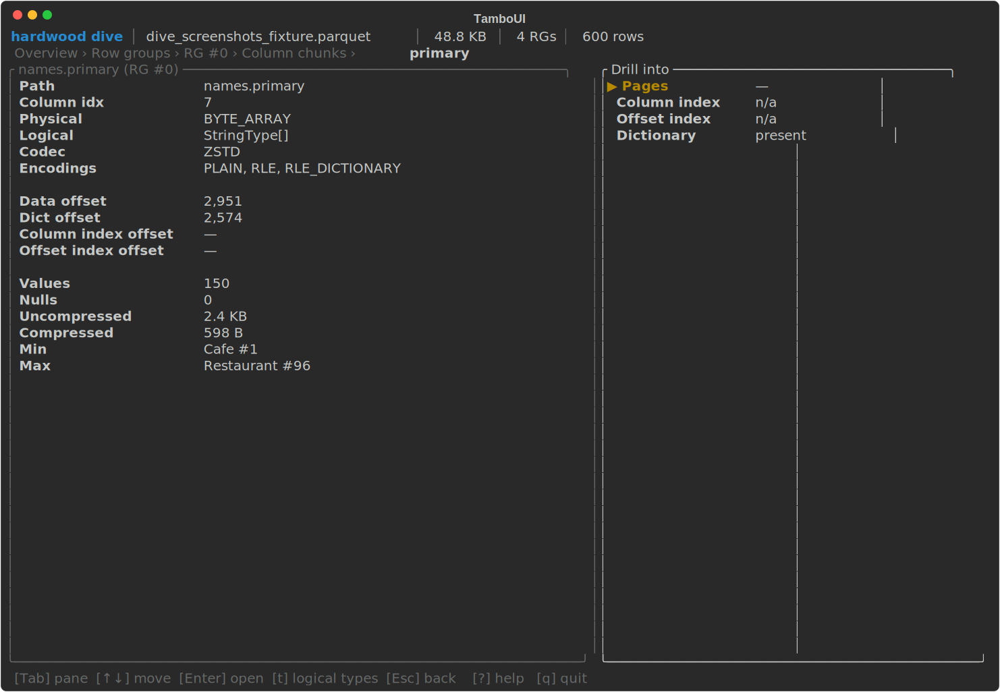
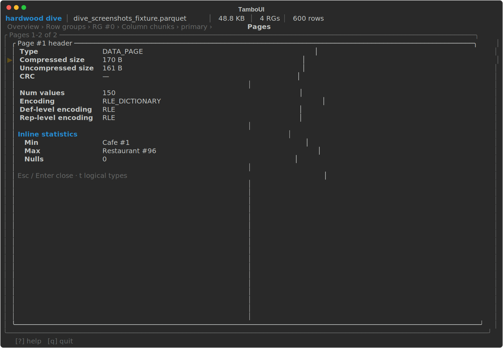
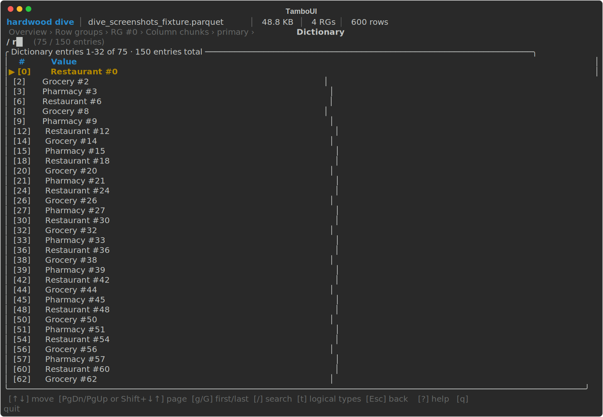
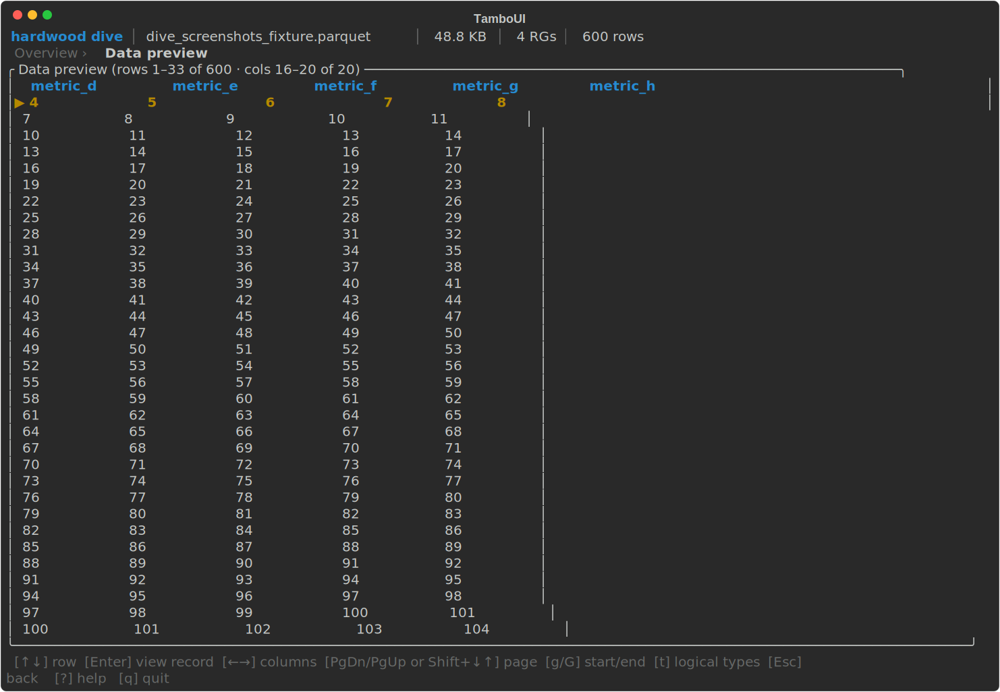

<!--

     SPDX-License-Identifier: CC-BY-SA-4.0

     Copyright The original authors

     Licensed under the Creative Commons Attribution-ShareAlike 4.0 International License;
     you may not use this file except in compliance with the License.
     You may obtain a copy of the License at https://creativecommons.org/licenses/by-sa/4.0/

-->
# CLI

The `hardwood` CLI lets you inspect and convert Parquet files from the command line — useful for exploring datasets, debugging file structure, and quick format conversions without writing Java code. It reads local files and S3 URIs, and ships as a GraalVM native binary with instant startup.

Pre-built native binaries for Linux, macOS, and Windows are available from the [release page](https://github.com/hardwood-hq/hardwood/releases/tag/{{cli_release_tag}}). You can also
run the CLI via Docker without installing it locally — see the [Docker section below](#docker).

!!! note "macOS"
    The binary is not notarized. On first run, macOS Gatekeeper will block it. Remove the quarantine flag after extracting:

    ```shell
    xattr -r -d com.apple.quarantine hardwood-cli-*/
    ```

## Available Commands

| Command | Description |
|---------|-------------|
| `hardwood info` | Display high-level file information |
| `hardwood schema` | Print the file schema, including logical-type annotations such as `VARIANT(1)` on Variant groups |
| `hardwood print` | Print rows as an ASCII table (head, tail, or all); Variant columns are decoded to JSON-like text |
| `hardwood convert` | Convert a Parquet file to CSV or JSON (head, tail, or all); Variant columns are emitted as a JSON string in CSV and as a native JSON subtree in JSON |
| `hardwood footer` | Print decoded footer length, offset, and file structure |
| `hardwood inspect pages` | List data and dictionary pages per column chunk; includes per-page min/max when the file has a page index |
| `hardwood inspect dictionary` | Print dictionary entries for a column |
| `hardwood inspect columns` | Show compressed and uncompressed byte sizes per column, ranked |
| `hardwood inspect rowgroups` | Display per-row-group column chunk metadata (sizes, codec) |
| `hardwood dive` | Interactively explore a file's structure in a TUI |
| `hardwood help` | Display help information about a command |

## Examples

```shell
# Show file overview
hardwood info -f data.parquet

# Print schema
hardwood schema -f data.parquet

# Show first 20 rows
hardwood print -n 20 -f data.parquet

# Show last 5 rows
hardwood print -n -5 -f data.parquet

# Show all rows
hardwood print -f data.parquet

# Convert to CSV
hardwood convert --format csv -f data.parquet

# Show dictionary entries for a column (first 50 entries per row group by default)
hardwood inspect dictionary -f data.parquet -c category

# Show all dictionary entries for a column (--limit 0 means unlimited)
hardwood inspect dictionary -f data.parquet -c category --limit 0

# Convert first 100 rows to JSON
hardwood convert -n 100 --format json -f data.parquet

# Convert last 50 rows to CSV
hardwood convert -n -50 --format csv -f data.parquet
```

## Interactive exploration (`dive`)

`hardwood dive` launches a terminal UI for interactively navigating a Parquet file's structure:

```shell
hardwood dive -f data.parquet
```

<script src="https://asciinema.org/a/992284.js" id="asciicast-992284" async="true"></script>

### What you can do with it

`dive` composes the slices that the batch subcommands (`info`, `schema`,
`footer`, `inspect`, `print`) each surface separately into a single
navigable session. Typical things to reach for it for:

- **Find a column quickly** in a wide schema — Schema screen, `/` to
  filter the tree to leaves matching a substring.
- **Spot the heavy column chunks** in a row group — Row groups → Column
  chunks ranks by compressed size with the codec and dictionary flag
  alongside.
- **Check page-level statistics and indexes** — drill from a chunk into
  Pages, Column index, or Offset index; `Enter` on a page opens the
  full thrift header, including inline statistics when no Column Index
  is present.
- **Inspect dictionary entries** for a column — Dictionary screen with
  `/` substring filter; `Enter` reveals the full untruncated value of
  the highlighted entry.
- **Preview a few rows** without exporting — Data preview paginates with
  `PgDn`/`PgUp` (`g`/`G` for first/last); `Enter` opens a per-row modal
  where each field can be expanded inline.
- **Decode key/value metadata** — Spark JSON schemas pretty-print, Arrow
  IPC schemas decode to a hex dump.
- **Compare a column across row groups** — from Schema, `Enter` on a
  leaf jumps to a one-row-per-RG view of that column's sizes,
  encodings, and stats.
- **Read raw file layout** — Footer & indexes shows file size, footer
  offset, encoding/codec histograms, page-index coverage, and aggregate
  byte breakdowns; from there you can drill into a file-wide list of
  every chunk's column index, offset index, or dictionary region.

### Keys

| Key | Action |
|-----|--------|
| `↑` / `↓` | Move selection |
| `PgDn` / `PgUp` (or `Shift-↓` / `Shift-↑`) | Page down / up |
| `g` / `G` | Jump to first / last row |
| `Enter` | Drill into the selected item |
| `Esc` / `Backspace` | Go back one level |
| `Tab` / `Shift-Tab` | Switch focused pane |
| `/` | Inline search (Schema, Column index, Dictionary) |
| `t` | Toggle logical / physical value rendering (screen-specific: Pages, Column index, Dictionary, Data preview, Column chunk detail) |
| `e` / `c` | Expand / collapse all (Schema tree; Data preview row modal) |
| `o` | Jump back to Overview |
| `?` | Toggle help overlay |
| `q` / `Ctrl-C` | Quit |

The keybar at the bottom of every screen lists the keys that are
actually meaningful in the current context — so the menus above show the
full vocabulary, but the keybar tells you which subset is live right
now.

Available screens:

- **Overview**
- **Schema** — expandable tree of groups and leaves
- **Row groups**
- **Row group detail**
- **Column chunks**
- **Column chunk detail** — facts pane plus drill menu
- **Pages** — with a page-header modal on Enter
- **Column index**
- **Offset index**
- **Footer & indexes** — also drills into a file-wide list of every chunk's column index, offset index, or dictionary region
- **Column-across-row-groups** — from the Schema screen
- **Dictionary** — full-value modal on Enter and `/` inline search
- **Data preview** — row values via `RowReader`; `←/→` scrolls the visible column window, `PgDn/PgUp` flips pages

A tour through the main screens (click any shot to open it full size):

<figure markdown="span">[{ width="720" }](../assets/cli/01-landing-overview.svg)<figcaption>Overview</figcaption></figure>

<figure markdown="span">[{ width="720" }](../assets/cli/02-schema-tree.svg)<figcaption>Schema — expandable tree of groups and leaves</figcaption></figure>

<figure markdown="span">[{ width="720" }](../assets/cli/03-1-rg.svg)<figcaption>Row groups</figcaption></figure>

<figure markdown="span">[{ width="720" }](../assets/cli/03-2-rg-detail.svg)<figcaption>Row group detail</figcaption></figure>

<figure markdown="span">[{ width="720" }](../assets/cli/03-3-rg-column-chunks.svg)<figcaption>Column chunks</figcaption></figure>

<figure markdown="span">[{ width="720" }](../assets/cli/03-4-rg-column-chunk-detail.svg)<figcaption>Column chunk detail — facts pane plus drill menu</figcaption></figure>

<figure markdown="span">[{ width="720" }](../assets/cli/04-pages-header-modal.svg)<figcaption>Pages — page-header modal on Enter</figcaption></figure>

<figure markdown="span">[{ width="720" }](../assets/cli/05-dict-search.svg)<figcaption>Dictionary — <code>/</code> inline search</figcaption></figure>

<figure markdown="span">[{ width="720" }](../assets/cli/06-data-scrolled-right.svg)<figcaption>Data preview — scrolled right across the column window</figcaption></figure>

Every screen shares a four-region layout — a top bar with file identity, a
breadcrumb showing the navigation stack, the active screen body, and a keybar
(all four visible in the Overview screenshot above).

### Typical drill path

1. **Overview** → pick *Row groups* from the drill menu.
2. **Row groups** → select a row, *Enter* — opens that row group's detail.
3. **Row group detail** → *Enter* — opens its column chunks.
4. **Column chunks** → select a column, *Enter* — opens the chunk detail.
5. **Column chunk detail** (facts pane + drill menu) → pick *Pages*, *Column
   index*, *Offset index*, or *Dictionary*.
6. Drill sub-screens (*Pages*, *Column index*, etc.) support *Esc* back up to
   the previous level; in *Pages* and *Dictionary*, *Enter* opens a modal with
   the full header / value.

Alternative entry: from **Overview → Schema**, navigate the tree of group and
primitive nodes with `→` / `←`; `Enter` on a leaf drills into a
*Column-across-row-groups* view — one row per row group showing that column's
sizes, encoding, stats — and from there into the chunk detail.

### Inline search

The **Schema**, **Column index**, and **Dictionary** screens support inline
search. Press `/` to enter search-edit mode:

- **Schema** — filters leaf columns whose field path contains the query.
  While the filter is active, the tree collapses to a flat list of matches.
- **Column index** — filters pages whose formatted min or max value
  contains the query.
- **Dictionary** — filters entries whose value contains the query.

In all three cases: typed characters extend the filter; *Backspace* trims;
*Esc* clears the filter and exits edit mode; *Enter* commits (keeps the
filter applied but exits edit mode). The table re-filters live as you type.

## Reading Files from S3

All commands accept `s3://` URIs via the `-f` flag:

```shell
hardwood schema -f s3://my-bucket/data.parquet
hardwood print -n 10 -f s3://my-bucket/data.parquet
```

The CLI resolves credentials via the standard AWS credential chain (`AWS_ACCESS_KEY_ID` / `AWS_SECRET_ACCESS_KEY` / `AWS_SESSION_TOKEN` environment variables, `~/.aws/credentials`, SSO, EC2/ECS instance profiles, web identity). See the [S3 module page](../how-to/s3.md) for the resolution order and provider details.

The CLI additionally reads these environment variables:

| Environment Variable | Description |
|----------------------|-------------|
| `AWS_REGION` | AWS region (also read from `~/.aws/config` if not set) |
| `AWS_ENDPOINT_URL` | Custom endpoint for S3-compatible services (MinIO, LocalStack, R2, etc.) |
| `AWS_PATH_STYLE` | Set to `true` to use path-style access (required by some S3-compatible services) |

## Shell Completion

The distribution includes a Bash completion script at `bin/hardwood_completion`. Source it in your shell to enable tab completion for commands, options, and arguments:

```shell
source hardwood_completion
```

To make it permanent, add the line above to your `~/.bashrc` or `~/.bash_profile`.

## Docker

A minimal Fedora-based Docker image is published to the GitHub Container Registry for Linux amd64 and arm64:

```shell
docker pull ghcr.io/hardwood-hq/hardwood:{{cli_docker_tag}}
```

Run any command by passing it after the image name:

```shell
docker run --rm ghcr.io/hardwood-hq/hardwood:{{cli_docker_tag}} --help
docker run --rm ghcr.io/hardwood-hq/hardwood:{{cli_docker_tag}} info -f /data/data.parquet
```

Mount a local directory to access files on the host:

```shell
docker run --rm \
  -v "$(pwd)":/data \
  ghcr.io/hardwood-hq/hardwood:{{cli_docker_tag}} \
  schema -f /data/data.parquet
```

The `dive` TUI needs an interactive terminal, so pass `-it`:

```shell
docker run --rm -it \
  -v "$(pwd)":/data \
  ghcr.io/hardwood-hq/hardwood:{{cli_docker_tag}} \
  dive -f /data/data.parquet
```

Start an interactive shell with tab completion pre-loaded:

```shell
docker run --rm -it \
  -v "$(pwd)":/data \
  ghcr.io/hardwood-hq/hardwood:{{cli_docker_tag}}
```
